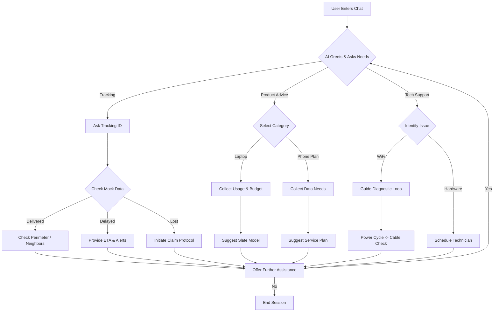

# 🤖 AI-Powered Support ChatBot | Slate Protocol

A premium, conversational AI assistant designed to handle customer inquiries for **Package Tracking**, **Product Recommendations**, and **Technical Support**. Powered by Google's Gemini 1.5 Flash.

## 🚀 Quick Start

### 1. Prerequisites
- A modern web browser (Chrome, Edge, Firefox).
- An active Internet connection (for Gemini AI access).

### 2. Setup
1.  **Download/Clone** this repository to your local machine.
2.  **Open `index.html`** in your browser.
3.  **Start Chatting!** The bot is pre-configured with a mock database and an AI key.

> [!NOTE]
> The API key is currently stored in `script.js` for demonstration purposes. In a production environment, this should be moved to a secure backend.

---

## 💡 Technical Approach

### 1. Conversational AI (Gemini)
The bot has transitioned from a rigid state-machine to a **Natural Language Interface**. 
- **LLM Engine**: Uses `gemini-2.5-flash-lite-preview` for high-speed, intelligent responses.
- **System Grounding**: The AI is "weighted" with a local tracking database (found in `script.js`), allowing it to provide exact status updates for specific IDs while maintaining a creative persona for advice and support.
- **Context Awareness**: Maintains a session-based history to allow for follow-up questions.

### 2. Enterprise UI/UX (Tailwind CSS)
The design follows the **Slate Protocol** aesthetic:
- **Responsive Layout**: Optimized for both Desktop and Mobile with `h-[100dvh]` for full-screen mobile alignment.
- **Micro-Animations**: Smooth message slide-ins and interactive loading states.
- **Component-Based Bubbles**: High-fidelity UI bubbles with timestamps and service-specific icons (AI/User).

### 3. Modular Decision Logic
- **Quick Replies**: The AI dynamically suggests follow-up actions (parsed from the model's output) and renders them as clickable pills.
- **Zero-Config Deployment**: No npm install or server setup required. Pure client-side integration.

---

## 📊 Conversation Flow

The following diagram illustrates the high-level decision paths handled by the AI assistant:

## 📸 Screenshots

### 1. Home / Initial Greeting
The AI initiates the conversation and offers immediate entry points.

### 2. Package Tracking in Action
Natural language tracking: "Where is PKG-12345678?"

### 3. Product Recommendation
Guidance for high-fidelity product choices based on user needs.

### 4. Technical Troubleshooting
Step-by-step diagnostic loops for WiFi and hardware support.

---

## 🛠️ Repository Structure
- `index.html`: Main UI & Tailwind Integration.
- `script.js`: AI Core & Conversation Logic.
- `key.txt`: Gemini API key (reference).
